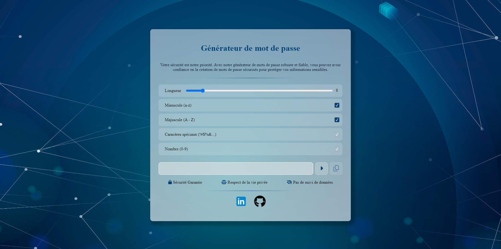

# Générateur de mots de passe sécurisés

Ce projet est un générateur de mots de passe sécurisés développé avec Angular. Il permet aux utilisateurs de générer des mots de passe aléatoires en fonction de certains critères, tels que la longueur du mot de passe et les types de caractères à inclure.

## Versions utilisées

- Angular CLI: 17.2.3
- Node.js: 18.16.1
- npm: 9.5.1

## Fonctionnalités

- Génération de mots de passe aléatoires.
- Personnalisation de la longueur et des caractères du mot de passe.
- Copie facile du mot de passe généré dans le presse-papiers.

## Installation

Pour utiliser l'application localement, suivez ces étapes :

1. Clonez ce dépôt sur votre machine locale.
2. Assurez-vous d'avoir Node.js et npm installés.
3. Exécutez `npm install` pour installer les dépendances du projet.
4. Exécutez `ng serve` pour lancer l'application. Naviguez vers `http://localhost:4200/` dans votre navigateur pour l'ouvrir.

## Utilisation

Une fois l'application ouverte dans votre navigateur, vous pouvez personnaliser les paramètres du mot de passe à générer à l'aide des options disponibles. Cliquez sur le bouton "Générer" pour obtenir un nouveau mot de passe, puis utilisez le bouton "Copier" pour copier le mot de passe dans le presse-papiers.

## Captures d'écran

## Contributions

Les contributions sont les bienvenues ! Si vous souhaitez contribuer à ce projet, veuillez créer une pull request avec vos modifications.

## Licence

Ce projet est sous licence MIT. Pour plus d'informations, consultez le fichier [LICENSE](LICENSE).
